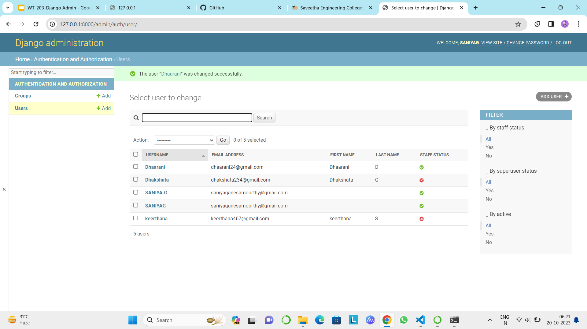

# Ex-02-Admin

# AIM
Create a Django website with five users. Two users are to be staff users (including admin) and the other three users are non-staff users.
# Design Procedure
# Step 1:
Creating five users.
# Step 2:
Two staff users and three non-staff users.
# Step 3:
Setting e-mail for all users.
# Step 4:
Setting the first name and last name for all users.
# Output:

# Result:
Admin user is succesfully created.

